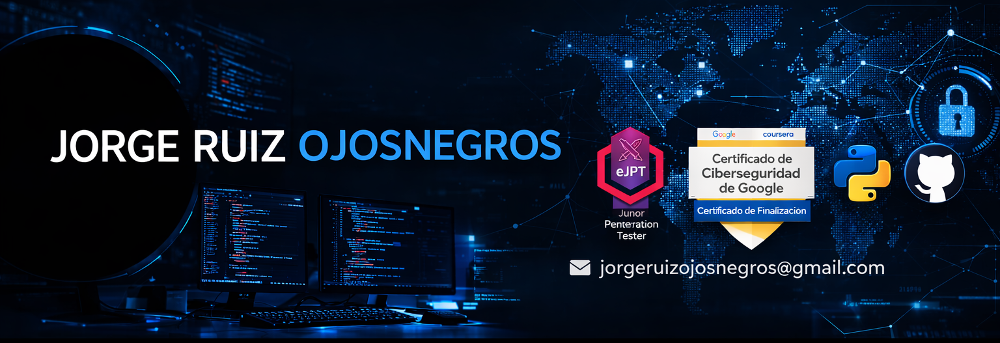

<p align="center">
<code>root@c0k3r0:~# ./welcome.sh</code>
</p>

---

## 🧠 About Me

```bash
root@c0k3r0:~# whoami
```

- 🛡️ Cybersecurity Enthusiast  
- 🎯 Aspiring Pentester / Blue Team  
- 🧪 CTF Player  
- 🔎 Security Research  

Currently documenting my journey while transitioning into cybersecurity.

Focused on:

- Offensive Security  
- Web Application Testing  
- Capture The Flag Challenges  
- Security Tool Development  

---

## 📜 Certifications

- 🥇 **eJPT v2 – Junior Penetration Tester (INE)**
- 🛡️ **Google Cybersecurity Professional Certificate**

---

## 🚀 Projects

### 🔍 CTF Writeups
Portfolio of solved CTF machines and challenges with detailed methodology.

### ⚙️ Security Tools
Development of scripts and tools for automation and security testing.

### 📁 Payloads & Cheatsheets
Personal repository with useful pentesting resources.

---

## 💻 Favorite Tools

### 🛰️ Reconnaissance & Enumeration


### 🔓 Credentials / Brute Force


### 🕷️ Web Application Security


### 💥 Exploitation


### 🩺 Privilege Escalation


### 📡 Network Analysis


### 🐍 Languages & Platforms


---

## 📊 GitHub Activity

<p align="center">


</p>


---

## 💻 Most Used Languages

<p align="center">

</p>

---

## 📫 Contact

- 🔗 LinkedIn → https://linkedin.com/in/jorgeruizojosnegros  
- 🌐 CTF Writeups → https://c0k3r0.github.io/ctf-writeups/

---

<p align="center">
⚡ Always learning | Always hacking ⚡
</p>


---

[⬅️ Volver al inicio](https://c0k3r0.github.io/ctf-writeups/)
