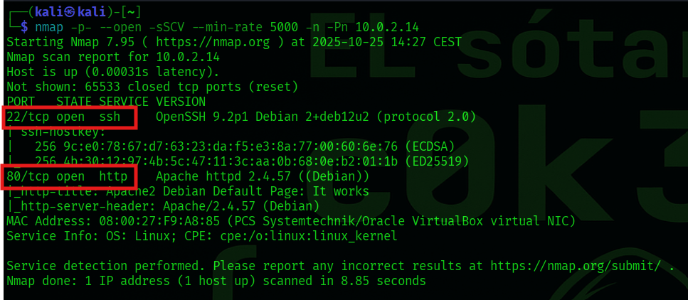
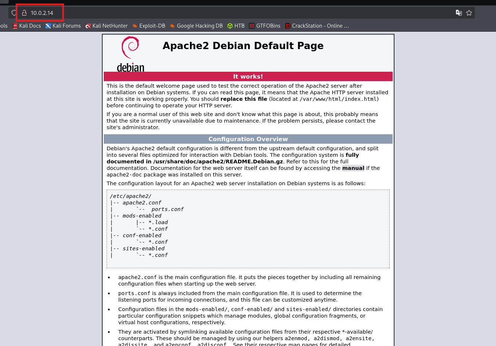
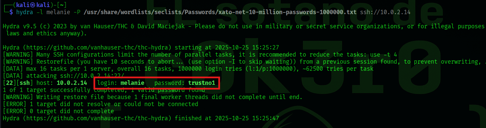
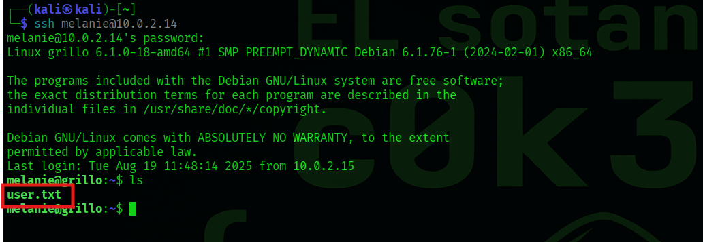
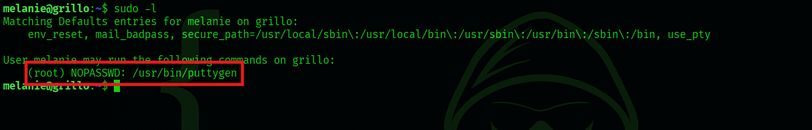
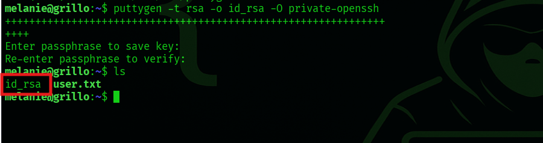
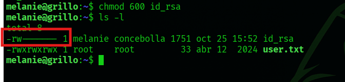
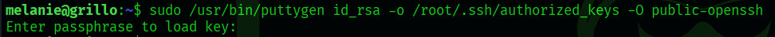
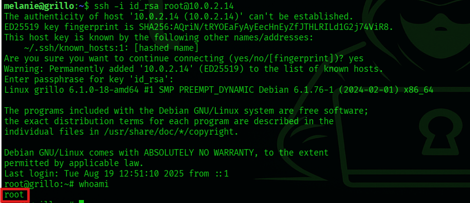

# 🧠 Write-up: Grillo (THL)

---

## 🔎 Escaneo de Puertos

Realizamos un escaneo con `nmap` para identificar servicios expuestos en la dirección `10.0.2.14`.

Se encontraron los siguientes puertos abiertos:
- **22/tcp (SSH)**
- **80/tcp (HTTP)**

---

## 🌐 Enumeración Web

Al acceder a la IP vía navegador, encontramos la página por defecto de Apache en Debian.

Esto indica que el servicio HTTP está operativo pero no proporciona información útil directamente.

---

## 📝 Descubrimiento de Información Sensible

Durante la enumeración de los archivos disponibles en el servidor, se halló un comentario en el código fuente:

> `// Cambia la contraseña de ssh por favor melanie`

Esto nos sugiere el posible nombre de un usuario: **melanie**.

---

## 🔐 Fuerza Bruta SSH

Utilizamos Hydra para lanzar un ataque de fuerza bruta contra el servicio SSH con el usuario `melanie`.

Hydra nos reveló las siguientes credenciales válidas:
- **Usuario:** melanie
- **Contraseña:** trustno1

---

## 📥 Acceso SSH

Con las credenciales obtenidas, accedemos exitosamente al sistema por SSH.

En el directorio personal de `melanie` encontramos el archivo `user.txt`.

---

## 🔍 Escalado de Privilegios

Comprobamos los permisos de sudo y descubrimos que el usuario puede ejecutar `puttygen` como root sin contraseña.

Puttygen es una herramienta de generación de claves SSH que se utiliza para generar pares de clave pública/privada.

---

## 🔑 Generación de Clave Privada

Usamos `puttygen` para generar una clave RSA privada.

---

## 🔒 Ajuste de Permisos

Le asignamos los permisos adecuados a la clave privada para poder utilizarla correctamente.

---

## 🛠️ Uso de Puttygen como root

Ejecutamos `puttygen` como root para convertir nuestra clave en una pública válida, y la guardamos directamente en `/root/.ssh/authorized_keys`.

---

## 🧙‍♂️ Acceso como root

Finalmente, utilizamos la clave privada para conectarnos via SSH al sistema como **root**.

¡Acceso root conseguido con éxito!

---

## ✅ Conclusión

Durante esta máquina:

- Enumeramos los servicios en ejecución.
- Descubrimos información sensible (usuario).
- Realizamos fuerza bruta de credenciales.
- Accedimos al sistema vía SSH.
- Escalamos privilegios explotando el uso de `puttygen` sin contraseña.

---

### Write-up realizado por **c0k3r0** — El Sótano de c0k3r0 �

[⬅️ Volver al inicio](https://c0k3r0.github.io/ctf-writeups/)
